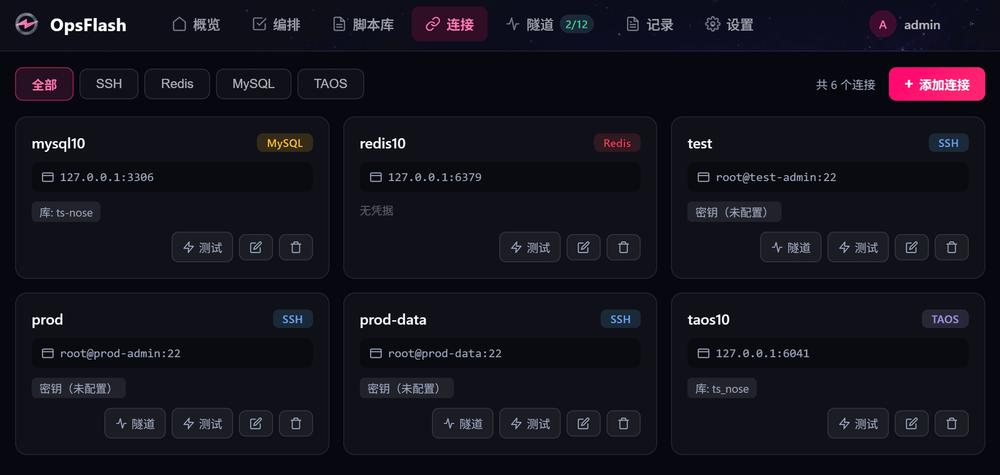
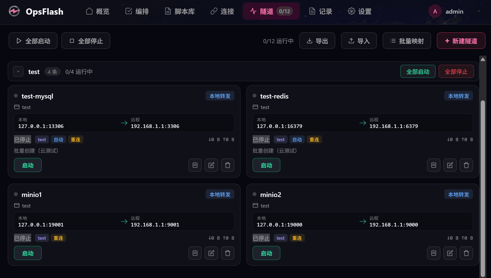

# OpsFlash

轻量级运维极速引擎 (The Flash Engine for Micro-Ops)


OpsFlash 是一款基于 **Wails v3 + Go + Vue 3** 的跨平台桌面运维工具。单二进制分发，本地 SQLite 存储，敏感凭据加密保护，让日常服务器运维轻快如一瞬闪电。

> 当前版本：v0.5.0 · License：MIT

## 仓库地址

- GitHub：<https://github.com/LeapSunrise26/OpsFlash>
- Gitee：<https://gitee.com/LeapSunrise/OpsFlash>

## 特性

- **用户与认证**：登录 / 登出，Token 会话（24h 过期），密码 bcrypt 哈希，用户管理（创建/修改/删除/角色）
- **连接管理**：SSH / Redis / MySQL / TDengine 连接统一管理，密码、私钥、口令凭据本地加密存储，连接测试（含往返延迟）
- **SSH 隧道**：local / remote / dynamic 三种端口转发，一键启停、断线自动重连、应用启动自启、分组与批量创建
- **命令库**：命令统一管理（环境分组、terminal / SSH / Redis / MySQL / TDengine 五种执行位置、cmd / PowerShell / Bash 脚本解释器）；非交互 / 交互终端 / 守护进程三种命令类型，ConPTY 实时输出、流式执行可停止
- **指令编排**：从命令库 / 脚本库选取步骤按序组合成批量任务；遇错停止 / 忽略错误两种依赖策略，顺序执行 + 进度面板实时观测，脚本步骤支持 `{{var}}` 流程参数注入
- **数据库执行**：Redis 指令（go-redis）、MySQL / TDengine SQL（taosAdapter REST 免 CGO）一键执行，查询结果以结构化表格展示在终端面板
- **脚本库**：bat / ps1 / sh 脚本统一管理（环境分组、在线编辑、重命名、一键执行）；ConPTY 实时输出、多会话并行、可停止；Windows 走 WSL bash / Git Bash（自动探测路径挂载）
- **桌面体验**：系统托盘（关闭最小化）、每日日志文件

## 技术栈

| 层 | 技术 |
|----|------|
| 桌面框架 | [Wails v3](https://wails.io/)（v3.0.0-beta.4） |
| 后端语言 | Go 1.25 |
| 前端 | Vue 3 + TypeScript + Vite 8 |
| SSH | golang.org/x/crypto/ssh（纯 Go，无 CGO） |
| Redis 客户端 | github.com/redis/go-redis/v9 |
| MySQL 驱动 | github.com/go-sql-driver/mysql |
| TDengine | taosAdapter REST 接口（纯 Go net/http，无 CGO） |
| 存储 | SQLite（modernc.org/sqlite，纯 Go 驱动） |

## 快速开始

### 环境要求

- Go 1.25+
- Node.js 20+（前端构建）
- [Wails3 CLI](https://v3.wails.io/)

### 开发模式

```bash
wails3 dev
```

热重载前端与后端改动。

### 构建产物

```bash
wails3 build
```

生成生产可执行文件到 `bin/` 目录。构建后端为服务模式（无 GUI，纯 HTTP）：

```bash
task build:server   # 或 task run:server
```

### 默认账号

首次启动内置管理员账号：`admin` / `123456`（登录后请尽快修改）。

## 项目结构

```
├── main.go                 # 应用入口（窗口、托盘、菜单、事件）
├── server/                 # Go 后端
│   ├── authservice.go      # 登录/会话
│   ├── userservice.go      # 用户管理
│   ├── connections.go      # 连接管理（ssh/redis/mysql/tdengine CRUD + 测试）
│   ├── opsservice.go       # 命令库（命令 CRUD）
│   ├── opsruntime.go       # 命令库执行运行时（流式/交互/守护/数据库 + ConPTY 噪声清洗）
│   ├── batchservice.go     # 指令编排（批量任务 CRUD + 顺序执行引擎 + 进度/停止）
│   ├── executor.go         # 执行器工厂（terminal/ssh/redis/mysql/tdengine）
│   ├── tunnelservice.go    # SSH 隧道 CRUD
│   ├── tunnelcontrol.go    # 隧道启停/分组控制
│   ├── tunnelruntime.go    # 隧道运行时管理
│   ├── scriptservice.go    # 脚本库（CRUD + 执行 + 环境管理）
│   ├── scriptenv.go        # 环境 CRUD（命令库/脚本库归属）
│   ├── cmd/                # 命令构造（cmd/powershell/bash + WSL 路径转换）
│   ├── pty/                # PTY 传输层（Windows ConPTY / Unix creack/pty）
│   ├── daemon/             # 守护进程（Windows Job Object 进程树管理）
│   ├── exec/               # 执行器（terminal / ssh / redis / mysql / tdengine）与连接测试
│   ├── secret/             # 凭据加密（DPAPI / AES-256-GCM）
│   └── tunnel/             # 隧道实现（local/remote/dynamic）
├── frontend/               # Vue 3 前端
│   └── src/components/pages/  # 页面：登录/首页/运维操作/命令库/脚本库/连接/隧道/环境/用户
├── docs/                   # 设计文档与数据库结构
└── build/                  # 平台打包配置
```

## 发布路线图

按阶段逐步开放能力：

| 阶段 | 版本 | 范围 |
|------|------|------|
| **第一阶段** | v0.1.0 | 用户管理、登录、首页、连接管理（SSH + 隧道管理） |
| **第二阶段** | v0.2.0 | 脚本库（bat/ps1/sh 本地脚本管理 + 一键执行） |
| **第三阶段** | v0.3.0 | 本地脚本：cmd、powershell、bash |
| **第四阶段** | v0.4.0 | 数据库执行：Redis、MySQL、TDengine ✅ |
| **第五阶段** | v0.5.0 | 指令编排（批量执行 + 依赖关系）✅ |

## 文档

- [连接设计](./docs/connections-design.md)
- [隧道设计](./docs/tunnel-design.md)
- [数据库结构](./docs/database-schema.sql)

## 软件截图

连接管理

隧道管理


## 开源协议

本项目基于 [MIT](./LICENSE) 协议开源。使用、修改、商用、分发均需保留版权声明。

## 反馈与贡献

- 欢迎提 Issue / PR
- 安全漏洞请私信或邮件至维护者，勿直接公开
